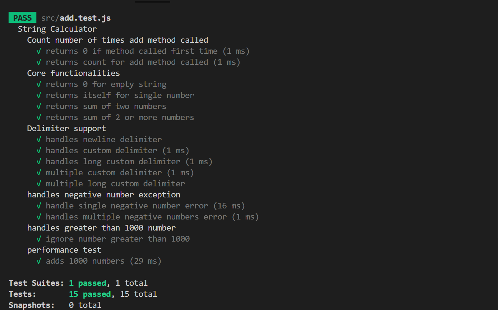

## Project Overview
A clean and efficient **String Calculator**, showcasing disciplined *TDD* and *performance-aware development*.  
It parses flexible input formats, handles custom delimiters, detects errors, and scales to large datasets — all thoroughly tested with Jest.

## Tech Stack
- Programming Language - JavaScript
- Framework - Node.js
- Testing Framework - Jest
- Performance module - perf_hooks, process.memoryUsage

## Installation & Running Tests
```bash
npm install
npm test
```

## Performance & Optimization
The implementation was benchmarked with inputs of over 10,000 numbers to validate scalability. After profiling, I identified inefficiencies caused by unnecessary intermediate arrays and refactored the code to process tokens more efficiently. This optimization reduced memory usage significantly while improving execution time.  

**Final benchmarks:** ~0.5 ms execution time, ~127 KB incremental memory usage.

## Screenshots

All tests passing:  

